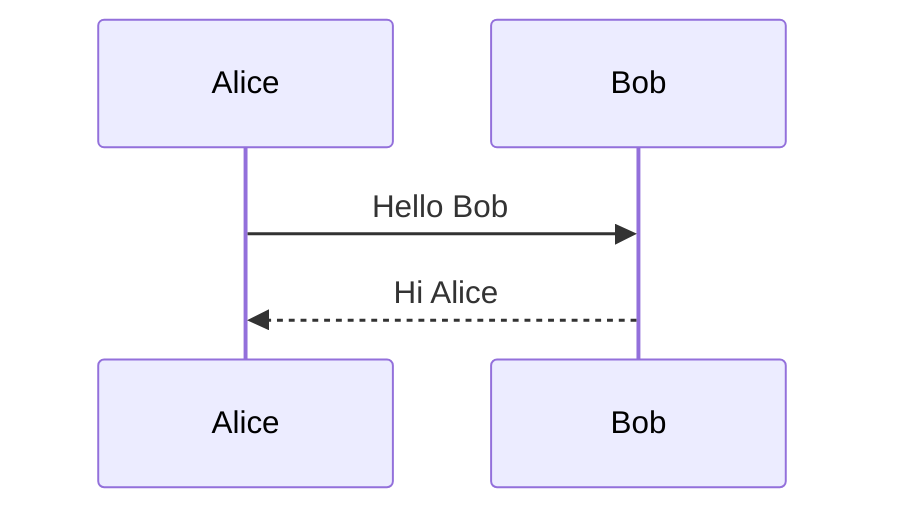

# Fossbook

A lightweight static blog site generator for GitHub Pages, similar to Hugo but built with Node.js.
It was originally part of the [F/OSS Comics blog](https://fosscomics.com) and is now an independent, installable package that anyone can use.

## Features

- **Markdown-based** — Write posts in Markdown with YAML front-matter
- **Pagination** — Automatic home page pagination
- **Tags** — Tag-based categorization with tag index and per-tag listing pages
- **Theming** — Bundled Archie theme with support for custom themes
- **SEO** — Open Graph and Twitter Card meta tags out of the box
- **Multilingual sites** — Generate language-specific pages with translation links and `hreflang` metadata
- **GitHub Pages** — Built-in CNAME support for custom domains
- **Dev server** — Local preview server with Express
- **Syntax highlighting** — Code block highlighting via highlight.js
- **Mermaid diagrams** — ` ```mermaid ` code blocks render as diagrams

## Quick Start

### Install globally

```bash
npm install -g fossbook
```

### Create a new site

```bash
mkdir my-blog && cd my-blog
fossbook init
```

This creates the following structure:

```
my-blog/
├── content/
│   ├── about.md
│   └── posts/
├── static/
│   └── images/
├── fossbook.config.js
└── package.json
```

### Create a new post

```bash
fossbook new "My First Post"
```

This creates `content/posts/My First Post/index.md` with pre-filled front-matter and an `images/` directory.

To create the default article and one or more configured translations together:

```bash
fossbook new "My First Post" --lang ko,ja
```

This also creates `index.ko.md` and `index.ja.md` in the same post directory. Running the command again preserves existing files and creates only missing translations.

### Build the site

```bash
fossbook build
```

### Preview locally

```bash
fossbook serve
```

Open http://localhost:3000 to view your site.

## Configuration

Create a `fossbook.config.js` in your project root:

```js
module.exports = {
  blogName: "My Blog",
  authorName: "Your Name",
  authorDescription: "A short bio",
  authorWebsite: "https://example.com",
  blogDescription: "A blog about things",
  blogsite: "https://example.com",

  // Optional
  githubCNAME: "example.com",
  googleAnalyticsID: "",
  authorTwitter: "@you",
  siteTwitter: "@yourblog",
  githubRepository: "https://github.com/you/your-blog",
  image: "https://example.com/default-image.png",
  theme: "archie",

  // Optional: URL prefix for posts. Defaults to "posts" -> /posts/<slug>/.
  // Set to "" to serve posts at the site root, /<slug>/.
  postsPath: "posts",

  // Optional multilingual configuration
  defaultLanguage: "en",
  defaultLanguageInSubdir: false,
  languages: {
    en: { languageName: "English", locale: "en-US" },
    ko: { languageName: "한국어", locale: "ko-KR" },
  },

  // Optional comments (see "Comments" below)
  comments: {
    provider: "utterances",
    repo: "you/your-blog",
    issueTerm: "pathname",
    theme: "github-light",
  },

  // Directory overrides (defaults shown)
  content: "./content",
  postsDir: "./content/posts",
  outputDir: "./public",
  staticDir: "./static",
  themesDir: "./themes",
};
```

## Content Format

### Post front-matter

```markdown
---
title: My Post Title
date: 2026-02-17
description: "A brief summary of the post"
image: "feature.png"
tags: "JavaScript, Node.js, Static Site"
---

Your Markdown content here...
```

### Directory structure

```
content/posts/My Post Title/
├── index.md
└── images/
    └── feature.png
```

### Post URLs

By default, posts are served under `/posts/`, e.g. `/posts/my-post-title/`. To
change the prefix or move posts to the site root, set `postsPath` in
`fossbook.config.js`:

```js
postsPath: "",          // serves the post above at /my-post-title/ (site root)
// postsPath: "blog",   // or use a different prefix: /blog/my-post-title/
```

This affects the generated output directory, the post URL, post links on the
home/all-posts/tag pages, and image paths. The on-disk source layout under
`content/posts/` does not change.

## Multilingual Sites

Fossbook generates a separate static page for each available language. The
browser loads only the selected language page; changing languages follows a
normal link and does not require JavaScript.

### Configuration

Add the languages supported by the site to `fossbook.config.js`:

```js
module.exports = {
  defaultLanguage: "en",
  defaultLanguageInSubdir: false,
  languages: {
    en: {
      languageName: "English",
      locale: "en-US",
    },
    ko: {
      languageName: "한국어",
      locale: "ko-KR",
    },
    ja: {
      languageName: "日本語",
      locale: "ja-JP",
    },
  },
};
```

Put localized blog information in a sibling config file for each language. For
example, `fossbook.config.en.js` contains:

```js
module.exports = {
  blogName: "My Blog",
  authorName: "Jane Doe",
  authorDescription: "Open source developer and writer",
  blogDescription: "An English-language blog",
};
```

And `fossbook.config.ko.js` contains:

```js
module.exports = {
  blogName: "나의 블로그",
  authorName: "이수현",
  authorDescription: "오픈 소스 개발자이자 작가",
  blogDescription: "한국어 블로그",
  homeLabel: "대문",
  allPostsLabel: "모든 글",
  aboutLabel: "소개",
  tagsLabel: "태그",
  allTagsLabel: "모든 태그",
};
```

- `defaultLanguage` identifies the language represented by `index.md` and
  `about.md`.
- `defaultLanguageInSubdir: false` keeps the default language at the site root.
  Other languages are generated below their language code, such as `/ko/`.
- Set `defaultLanguageInSubdir: true` to generate the default language below
  its code as well, such as `/en/`.
- Language config files use the main config filename with the language code
  inserted before the extension: `fossbook.config.<language>.js`.
- Values omitted from a language config fall back to `fossbook.config.js`.
- `locale` controls language-specific date formatting.
- Language keys should use standard language tags such as `en`, `ko`, `ja`, or
  `zh-Hant`.

If `languages` is omitted, Fossbook keeps its existing single-language
behavior and URLs.

### Create translated posts

Create only the default-language article:

```bash
fossbook new "Charles Babbage and Ada Lovelace"
```

Create the default article and multiple translations together:

```bash
fossbook new "Charles Babbage and Ada Lovelace" --lang ko,ja
```

The languages passed to `--lang` must be present in the `languages`
configuration. The command always ensures that the default `index.md` exists,
then creates the requested translation files. Existing Markdown files and
images are never overwritten, so the command can be run later to add another
translation:

```bash
fossbook new "Charles Babbage and Ada Lovelace" --lang ja
```

### Source structure

Translations live in the same post bundle and share its `images/` directory:

```text
content/
├── about.md
├── about.ko.md
└── posts/
    └── Charles Babbage and Ada Lovelace/
        ├── index.md
        ├── index.ko.md
        ├── index.ja.md
        └── images/
            └── feature.png
```

- `index.md` is the default-language article.
- `index.<language>.md` is a translated article.
- `about.md` is the default About page.
- `about.<language>.md` is a translated About page.
- A translation is generated only when its Markdown source exists. Fossbook
  does not substitute default-language content for a missing translation.

### Generated output

With `defaultLanguage: "en"` and `defaultLanguageInSubdir: false`, the example
above generates:

```text
public/
├── index.html
├── about/index.html
├── posts/Charles Babbage and Ada Lovelace/index.html
├── ko/
│   ├── index.html
│   ├── about/index.html
│   └── posts/Charles Babbage and Ada Lovelace/index.html
└── ja/
    ├── index.html
    └── posts/Charles Babbage and Ada Lovelace/index.html
```

Translated article and About pages display ISO language links such as `EN`,
`KO`, and `JA`. Only translations that exist are shown. These pages also emit
canonical URLs and `hreflang` alternate links for search engines.

### Mermaid diagrams

Fenced code blocks tagged `mermaid` are rendered as diagrams instead of code.
The [Mermaid](https://mermaid.js.org) script is loaded from a CDN only on pages
that contain a diagram.

````markdown

````

## CLI Reference

```
Usage: fossbook <command> [options]

Commands:
  build          Build the static site
  serve          Build and start a local dev server
  new <title>    Create a new post
  init           Create a new fossbook site project

Options:
  -c, --config   Path to config file (default: ./fossbook.config.js)
  -o, --output   Output directory (default: ./public)
  -p, --port     Dev server port (default: 3000)
  --lang         (new) Comma-separated translation languages, e.g. ko,ja
  -v, --version  Show version number
  -h, --help     Show help
```

## Theming

Fossbook ships with the Archie theme by default. To use a custom theme:

1. Create a `themes/<your-theme>/` directory in your project
2. Add `layouts/` (HTML templates) and `assets/` (CSS, fonts, images)
3. Set `theme: "your-theme"` in `fossbook.config.js`

Theme resolution order: user project `themes/` → built-in `themes/`.

## Comments

Fossbook supports [utterances](https://utteranc.es) — a commenting widget that
stores comments as GitHub issues. When enabled, a comment box is rendered at the
bottom of every post page.

### Setup

1. Make the repository that backs the comments **public**.
2. Install the [utterances GitHub App](https://github.com/apps/utterances) on
   that repository so the bot can create issues.
3. Add a `comments` block to `fossbook.config.js`:

```js
comments: {
  provider: "utterances",        // currently the only supported provider
  repo: "you/your-blog",         // owner/repo that stores the comment issues
  issueTerm: "pathname",         // how a post maps to an issue (see below)
  theme: "github-light",         // any utterances theme, e.g. "github-dark"
},
```

Omit the `comments` block (or set it to `null`) to disable comments.

### Options

| Field       | Required | Default          | Description                                                      |
| ----------- | -------- | ---------------- | ---------------------------------------------------------------- |
| `provider`  | yes      | —                | Must be `"utterances"`.                                          |
| `repo`      | yes      | —                | `owner/repo` whose issues store the comments.                    |
| `issueTerm` | no       | `"pathname"`     | Mapping between a page and its issue: `pathname`, `url`, `title`, `og:title`. |
| `theme`     | no       | `"github-light"` | Any [utterances theme](https://utteranc.es/#configuration).      |

### Mapping notes

With `issueTerm: "pathname"`, each post is matched to a GitHub issue whose title
equals the page's pathname (with the leading slash stripped). If you change a
post's URL, the existing comment thread no longer matches — rename the issue
title to the new pathname to keep the old comments.

### Required layout files

```
layouts/
├── home.html        # Home page with pagination
├── post.html        # Individual post page
├── page.html        # Static pages (e.g., about)
├── all_posts.html   # All posts listing
├── tag.html         # Per-tag listing
├── tag_list.html    # Tag index page
└── partials/
    └── footer.html  # Footer partial
```

## Deploying to GitHub Pages

Fossbook can automatically deploy your blog to GitHub Pages using GitHub Actions.

### Prerequisites: Install GitHub CLI (`gh`)

The `fossbook deploy` command uses the GitHub CLI to create repositories and monitor deployments.

**Linux (Debian/Ubuntu):**

```bash
sudo apt install gh
```

**macOS:**

```bash
brew install gh
```

**Windows:**

```bash
winget install GitHub.cli
```

Then authenticate with your GitHub account:

```bash
gh auth login
```

Follow the prompts to log in via browser or token.

### Initialize with GitHub

```bash
mkdir my-blog && cd my-blog
fossbook init --github
```

This will:
1. Scaffold the site project (config, content directories)
2. Create a GitHub repository for your blog
3. Generate `.github/workflows/deploy.yml` for automatic deployments
4. Push the initial commit to GitHub

### Publish a post

```bash
fossbook new "My New Article"
# ... edit content/posts/My New Article/index.md ...
fossbook deploy
```

Fossbook will build the site, commit, push to GitHub, wait for the CI/CD pipeline to finish, and display the live URL:

```
Building site... done.
Committing: "Publish: My New Article"
Pushing to origin/main...
Waiting for GitHub Pages deployment... ✓

✅ Published! View your article at:
   https://username.github.io/my-blog/My%20New%20Article/
```

**Deploy options:**

```bash
fossbook deploy --message "Update homepage"   # Custom commit message
fossbook deploy --no-wait                     # Push without waiting for CI
```

## License

- Generator code: [BSD 3-Clause License](https://opensource.org/licenses/BSD-3-Clause)
- Archie theme: [MIT License](https://github.com/athul/archie?tab=MIT-1-ov-file#readme)

## Credits

Adapted from [kartiknair's blog](https://github.com/kartiknair/blog) and styled using the [Archie theme](https://github.com/athul/archie).
