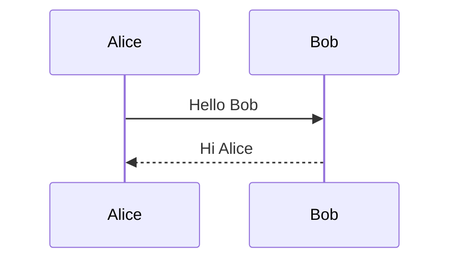

# Custom Markdown

Fossbook supports GitHub Flavored Markdown through
[`marked`](https://marked.js.org/) and adds a few extensions for images,
comics, links, diagrams, and code blocks.

## Images

Use normal Markdown image syntax. Images are centered by default:

```markdown

```

The text in square brackets becomes the image's alternative text. Paths to
post images are relative to the Markdown file and normally point into the
post's `images/` directory.

### Captions

Add a Markdown image title to display a caption:

```markdown

```

### Size

Add `size:<percentage>` to the image title to set its width:

```markdown

```

Only integer percentages are supported. The image remains responsive and
will not grow beyond its content area. The bundled Archie theme uses the
requested width on larger screens and expands sized images to `100%` on
screens narrower than 600 pixels.

### Alignment

Add `align:left`, `align:center`, or `align:right` to the image title:

```markdown


```

Combine size, alignment, and a caption in the same title:

```markdown

```

Directives are lowercase and must not contain a space after the colon. After
Fossbook removes the directives, any remaining title text becomes the
caption.

## Comic Dialogue

Place a blockquote immediately after an image to associate the text with that
image as comic dialogue:

```markdown

> First line of dialogue. \
> Second line of dialogue.
```

For multiline dialogue, end each line except the last with a backslash (`\`)
to insert a visible line break. Without it, Markdown treats consecutive lines
as part of the same paragraph and the browser displays them as flowing text.

The bundled Archie theme keeps the dialogue width synchronized with a sized
image and displays a transcript visibility control on posts that contain this
pattern. A blank line between the image and blockquote is allowed. Intervening
prose breaks the association, leaving the blockquote as an ordinary quotation.

## Panel Groups

Place images in a `panels` container to arrange them as a responsive grid:

```markdown
:::panels columns="2" label="Computing pioneers"
")
")
:::
```

The optional `columns` attribute sets the preferred desktop column count and
accepts integers from `1` to `6`. It defaults to `2`. The bundled Archie theme
collapses panel groups to one column on screens narrower than 600 pixels.

Use the optional `label` attribute to give the group an accessible name.
Images inside the group retain the usual image caption, size, and alignment
features. Unsupported, duplicate, or malformed attributes stop the build with
an error instead of being ignored.

Add `boxed="true"` to give each panel an equal-height border and background.
The optional `style` attribute customizes those cards using CSS declaration
syntax:

```markdown
:::panels columns="3" boxed="true" style="border: 2px solid #333; box-shadow: 2px 2px 0 #bbb; gap: 1rem;"


:::
```

Supported properties are `border`, `border-color`, `border-width`,
`border-style`, `border-radius`, `box-shadow`, `background`,
`background-color`, and `gap`. The `style` attribute requires `boxed="true"`.
Box shadows are disabled by default and appear only when `box-shadow` is set.

## Aligned Links

Links accept the same alignment directive in their optional title:

```markdown
[Previous chapter](previous/ "align:left")
[Contents](../ "align:center")
[Next chapter](next/ "align:right")
```

Without an `align:` directive, a link remains inline with its surrounding
text. With a directive, Fossbook places it in a block aligned to the selected
side.

## Mermaid Diagrams

Use a fenced code block tagged `mermaid`:

````markdown

````

Fossbook emits a Mermaid container and loads the Mermaid browser module only
on pages that contain a diagram. Rendering therefore requires network access
to the configured CDN when the page is first loaded.

## Highlighted Code

Fenced code blocks are highlighted with highlight.js. Add a language name
after the opening fence for explicit highlighting:

````markdown
```javascript
const greeting = "Hello";
console.log(greeting);
```
````

When the language is omitted or unknown, Fossbook uses automatic language
detection.